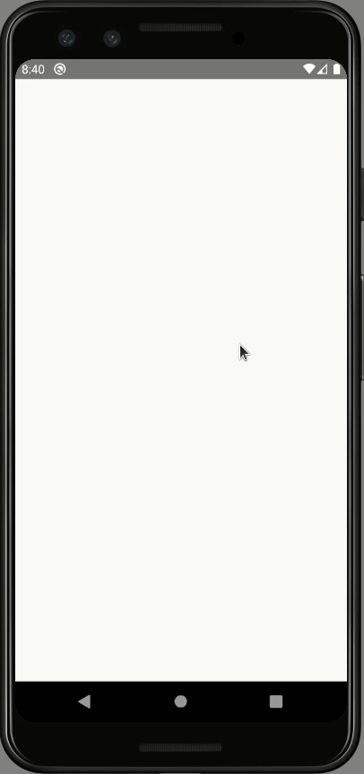

# POC: Server Sent Events

It demonstrate how to receive messages asynchronously from a server using Server Sent Events (SSE) protocol.

## How to run

### Client

| Description | Command |
| :--- | :--- |
| Install dependencies | `npm install` |
| Start Metro | `npm start` |
| Run app | `npm run android` |
| Forward localhost requests | `npm run forward` |

### Server

| Description | Command |
| :--- | :--- |
| Install dependencies | `npm install` |
| Start server | `npm start` |

## Preview

